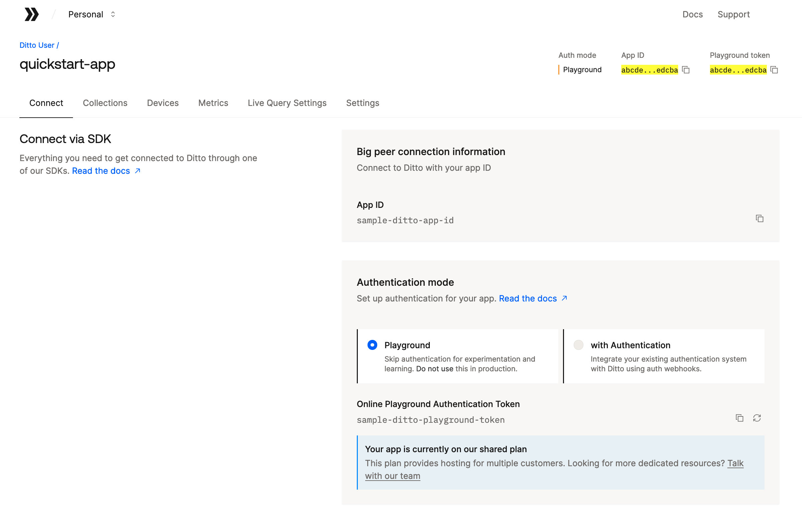

# Ditto Quickstart Apps 🚀

This repo contains apps that demonstrate how to use the Ditto SDK for supported
programming languages and platforms.

See Ditto's [Quickstarts](https://docs.ditto.live/sdk/latest/quickstarts/quickstarts-landing)
documentation for more information.

For support, please contact Ditto Support (<support@ditto.com>).

> [!IMPORTANT]
> This repository is a read-only mirror maintained by Ditto's SDK release
> process. Pull requests opened outside that process are not accepted. To report
> a problem or request a change, contact Ditto Support (<support@ditto.com>).

## Obtaining your Ditto Identity

The Ditto SDK requires you to provide an identity for your application, which may be
generated using the [Ditto Portal](https://portal.ditto.live/). For the purposes of these
quickstart applications, we'll be using the "Development" identity type.

> [!IMPORTANT]
> The Development identity type is _not_ suitable for production use. It is intended
> only for development and testing purposes.

To obtain your Ditto identity and configure the quickstart apps with it, follow these steps:

1. Create a free account in the [Ditto Portal](https://portal.ditto.live/).
1. Create an app in the Ditto Portal.
1. Copy the `.env.sample` file to `.env`.
   - in a terminal: `cp .env.sample .env`.
   - in a macOS Finder window, press `⇧⌘.` (SHIFT+CMD+period) to show hidden files.
   - Flutter uses `flutter_app/.env`, and the .NET Framework 4.8 app uses
     `dotnet-winforms-net48/.env`; see their app-specific READMEs.
1. Save your Database ID, Development Token, and Server URL in the `.env` file.

## Offline-only mode (optional)

The quickstart apps can also run in offline-only mode, where peers sync directly
with each other over Bluetooth/LAN/etc. and do not connect to Ditto's cloud.
This requires an offline-only license token, which you can request by contacting
<support@ditto.com>.

To run in offline mode, set `DITTO_OFFLINE_LICENSE_TOKEN` in your `.env` file.
When this variable is non-empty, the app initializes in offline-only mode and
does not use `DITTO_DEVELOPMENT_TOKEN` or `DITTO_SERVER_URL`. When it is empty
or unset, the app connects to the configured server using development
authentication.

Please see the app-specific README files for details on the tools necessary to
build and run them.

## Apps

- [Android Kotlin](android-kotlin/README.md)
- [Android Java](android-java/README.md)
- [Kotlin Multiplatform](kotlin-multiplatform/README.md)
- [Java Server](java-server/README.md)
- [C++ TUI](cpp-tui/README.md)
- [C# .NET MAUI](dotnet-maui/README.md)
- [C# .NET TUI](dotnet-tui/README.md)
- [C# .NET Win Forms](dotnet-winforms/README.md)
- [C# .NET Win Forms (.NET Framework 4.8)](dotnet-winforms-net48/README.md)
- [Electron](electron/README.md)
- [Flutter](flutter_app/README.md)
- [Go TUI](go-tui/README.md)
- [Javascript TUI](javascript-tui/README.md)
- [Javascript Web](javascript-web/README.md)
- [React Native](react-native/README.md)
- [React Native Expo](react-native-expo/README.md)
- [Rust TUI](rust-tui/README.md)
- [Swift](swift/README.md)

## 📄 License

This repo is licensed under the MIT License. See the [LICENSE](LICENSE) file for
rights and limitations.
