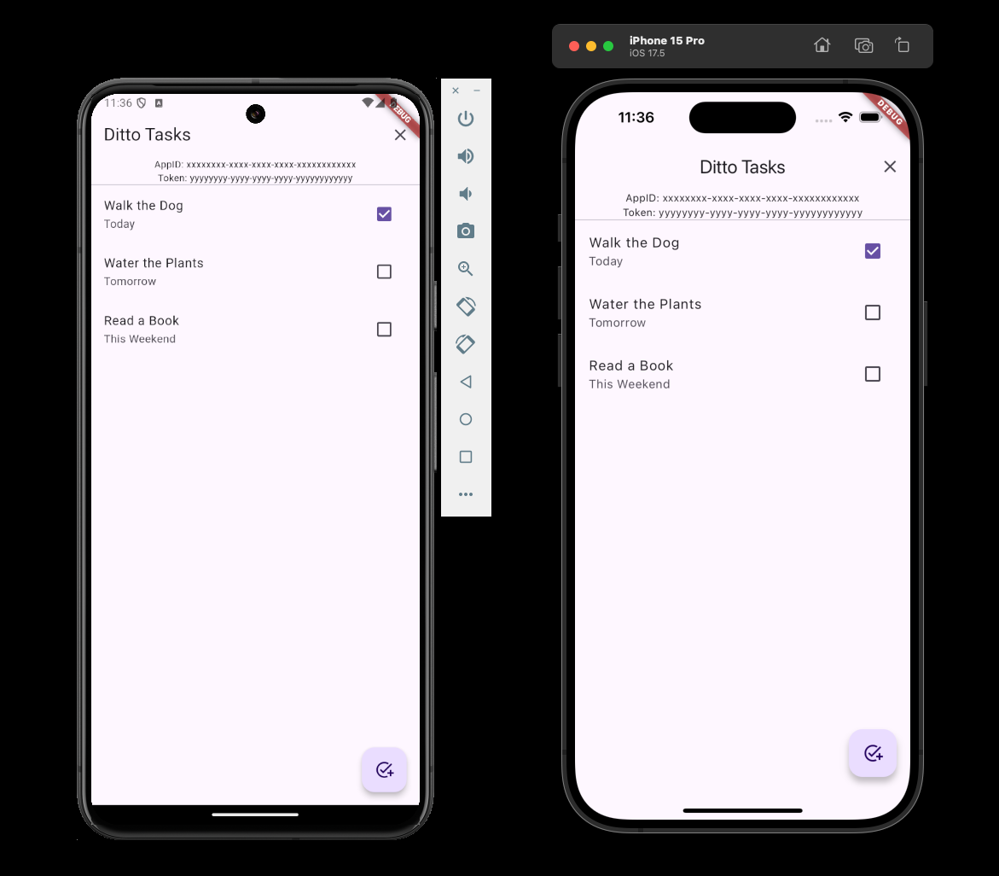

# Ditto Flutter Quickstart Demo App

This is a basic task application that demonstrates how to use Ditto's peer-to-peer data sync within your Flutter Application.



## Prerequisites

- Dart SDK installed
- Flutter SDK installed (tested on 3.24)
- Java Virtual Machine (JVM) 11 installed 
- Git command line installed (Windows requirement)
- XCode installed (for iOS development)
- Android Studio installed (for managing the Android SDK)
- Android SDK installed
- IDE of choice (Android Studio, VS Code, etc)

## Getting Started

### 1. Clone the Repository

- Clone the repository from GitHub. Open a terminal and run the following command:

```bash
git clone https://github.com/getditto/quickstart
```

- Navigate to the project directory:

```bash
cd quickstart/flutter_app
```

### 2. Install Dependencies

Install the necessary flutter dependencies.

```bash
flutter pub get
```

### 3. Configure Ditto
> [!NOTE] 
>If you haven't created a Ditto Portal account, you can sign up at [Ditto Portal](https://portal.ditto.live) or checkout [this video](https://www.youtube.com/watch?v=1aLiDkgl0Dc) on how to setup a Ditto Portal account.
>

#### Obtain App ID and Playground Token

- Log in to your Ditto Portal account
- Navigate to your application and obtain the App ID and Playground Token (see [Sync Credentials](https://docs.ditto.live/get-started/sync-credentials)
 for more details)

Copy the `.env.sample` file at the top level of the quickstart repo to `.env` and put it into the flutter_app directory (same directory as pubspec.yaml) and add your app ID, online playground token, authUrl and websocket URL.  The app will crash if you don't provide an .env file.

### 4. Run the Application

#### Run the Application on Android

- Ensure you have an Android Emulator running or connect a physical device
- Run the following command in the terminal from the root of the application

```bash
flutter run
```

- Select the Android Emulator/Device

```text
[1]: sdk gphone64 arm64 (emulator-1234)
[2]: Mac Designed for iPad (mac-designed-for-ipad)
Please choose one (or "q" to quit):
```


#### Run the Application on iOS

> [!NOTE]
> If you are going to use a physical iPhone, you will need to update the Team under Signing & Capabilities in XCode.  You can open the ios/Runner.xcodeproj file in XCode and then set your team from the Runner Target -> Singing & Capabilities tab.
>

- Ensure that cocoapods is up to date

```bash
gem install cocoapods
```

- Ensure you have an iOS Simulator running or connect a physical iOS device
 
Run the following command in the terminal and select the iOS Simulator/Device

```bash
flutter run
```
- Select the iOS Simulator/Device

```text
[1]: iPhone 15 (5A8DFE9D-7BF0-4BEE-A675-A056B64CEE3F)
[2]: Mac Designed for iPad (mac-designed-for-ipad)
Please choose one (or "q" to quit):
```

### 5. Sync-Data Offline

- Launch the application on multiple devices, emulators, or simulators
- Disconnect from your current WiFi network while keeping WiFi enabled on the device to allow for LAN connections
- Create new Tasks and update the Done status of existing tasks

> [!NOTE]
>Android Emulators cannot connect to iOS Simulators for offline sync due to platform limitations
>

# Additional Resources

Explore the following links and resources to learn more about Ditto:

#### General Information

- [Ditto Home Page](https://ditto.live)
- [Ditto Documentation Site](https://docs.ditto.live)
- [Ditto Flutter Install Guide](https://docs.ditto.live/flutter/installation)
- [Ditto Flutter Quick Start](https://docs.ditto.live/flutter/installation)
- [Ditto Flutter Roadmap](https://docs.ditto.live/flutter/roadmap)

#### Technical Information
- [Ditto Data Store CRUD](https://docs.ditto.live/crud/create)
- [Ditto Data Sync Subscriptions](https://docs.ditto.live/sync/subscriptions-management)
- [Ditto Query Language](https://docs.ditto.live/dql)
