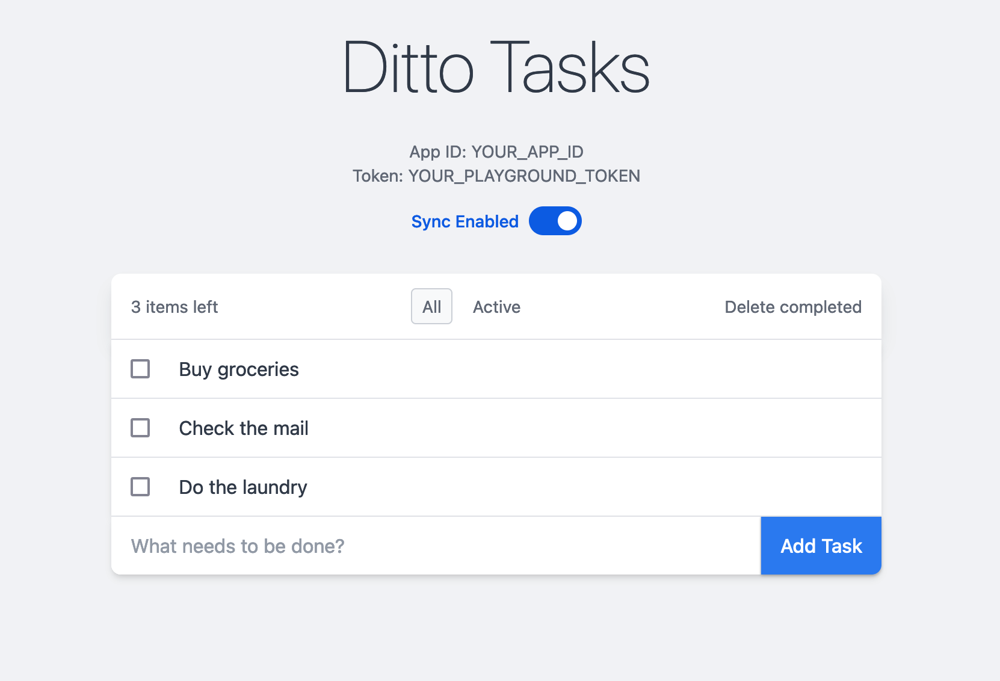

# Ditto JS Web Quickstart App 🚀

This directory contains Ditto's quickstart app for in-browser web applications.
This app uses Vite along with Typescript and React, and shows how to include
the Ditto SDK in a client-side app running in the browser.



## Documentation

- [Javascript Install Guide](https://docs.ditto.live/sdk/latest/install-guides/js)
- [Javascript API Reference](https://docs.ditto.live/sdk/latest/api-reference/js)
- [Javascript Release Notes](https://docs.ditto.live/sdk/latest/release-notes/js)

## Prerequisites

- [Node.js](https://nodejs.org/) v20 or later

## Getting Started

To get started, you'll first need to create an app in the [Ditto Portal][0]
with the "Development" authentication type. You'll need to find your
Database ID and Development Token in order to use this quickstart.

[0]: https://portal.ditto.live

From the repo root, copy the `.env.sample` file to `.env`, and fill in the
fields with your Database ID and Development Token:

```
cp .sample.env .env
```

The `.env` file should look like this (with your fields filled in):

```bash
#!/usr/bin/env bash

# Copy this file from ".env.sample" to ".env", then fill in these values
# A Ditto Database ID, Development token, and Server URL can be obtained from https://portal.ditto.live
DITTO_DATABASE_ID=""
DITTO_DEVELOPMENT_TOKEN=""
DITTO_SERVER_URL=""
```

Next, run the quickstart app with the following command:

```
npm install && npm run dev
```

## Offline-only mode (optional)

Set `DITTO_OFFLINE_LICENSE_TOKEN` in the repo-root `.env` to run this
app in offline-only mode (peer-to-peer only, no cloud sync). When the
token is non-empty, the playground/auth/websocket vars are not used.
Request a token from <support@ditto.com>. See the top-level
[README](../README.md#offline-only-mode-optional) for full details.
